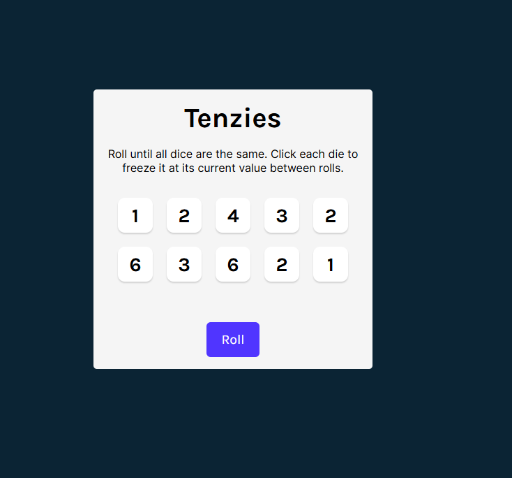
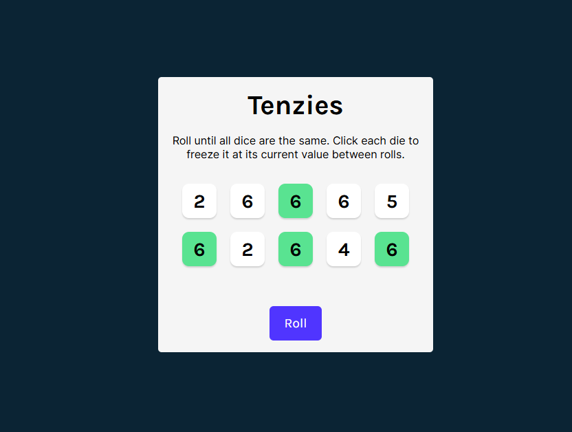
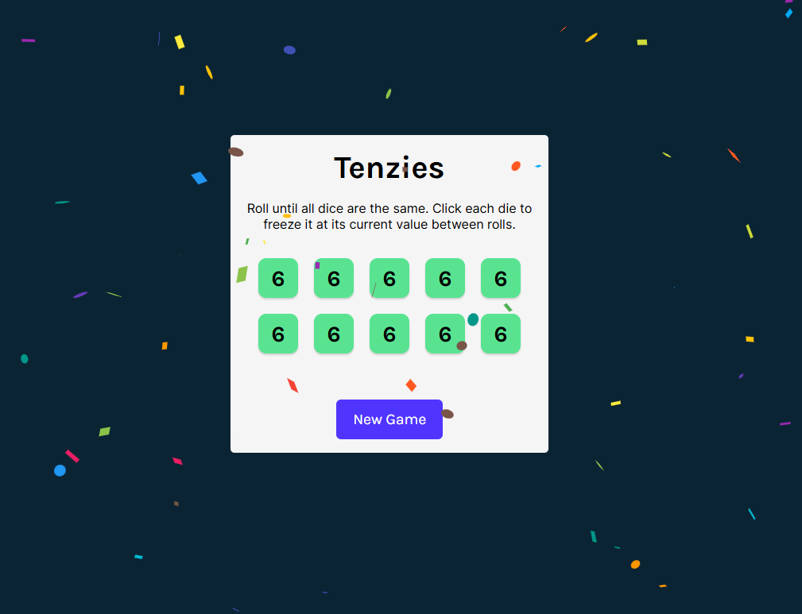

# 🎲 Tenzies Game

**Tenzies** is a fast-paced web game built with **React + Vite** where your goal is to roll dice until all dice show the same value — all while trying to be strategic with which dice to hold.

---

## 🌐 Live Demo

🚀 **Play the game here:**  
👉 https://tenzies-six-fawn.vercel.app/

---

## 🚀 Features

- 🎯 Roll ten dice and try to make them all show the same number  
- 🛑 Hold the dice you want to keep before rolling again  
- 🧠 Simple and fun logic that’s easy to play, hard to master  
- 🖥️ Responsive UI built with React & Vite  

---

## 📸 Screenshots

### New Game


### Playing


### Game Won


---

## 🛠️ Tech Stack

| Category      | Technologies |
|--------------|-------------|
| Frontend      | React, Vite |
| Styling       | Plain CSS |
| Game Logic    | JavaScript (React Hooks to control state) |
| Hosting   | Vercel |

---

## 📋 Getting Started

### Prerequisites  
- Node.js (v14 + recommended)  
- npm

### Installation  
1. Clone the repo  
     ```bash
     git clone https://github.com/TasinTausif/tenzies.git
     cd tenzies

2. Install dependencies

    ```bash
    npm install

3. Run the development server
    ```bash
    npm run dev

Open in your browser
  Visit: http://localhost:5173

### 🎮 How to Play

  On the game screen, you’ll see ten dice with random numbers.
  
  Click on any dice you want to “hold” — those won’t roll again.
  
  Click the Roll button to roll the remaining dice.
  
  Repeat until all ten dice show the SAME number.
  
  When you win, you’ll see a finish screen with confetti and a restart button.
